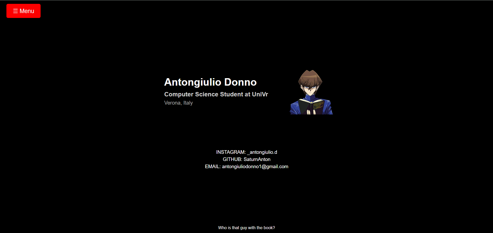

# MY-PERSONAL-WEBSITE

Hello everyone, this is my personal website. I developed it using React and Vite, writing the code in TypeScript and CSS. Additionally, I utilized the Vercel platform for deployment and online hosting.

 

## LANGUAGES USED 

| Linguaggio   | Logo |
|-------------|------|
| **CSS**     |  |
| **TypeScript** |  |
